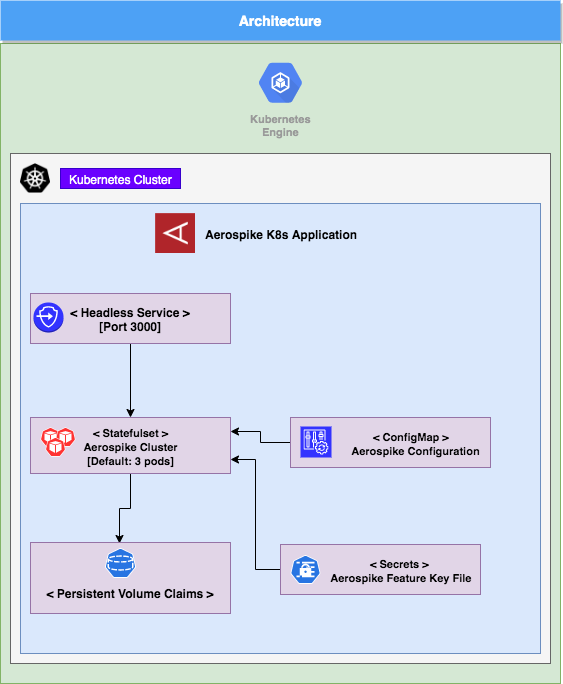

# Overview

Aerospike is a high performance, flash optimized NoSQL database.

This repo contains aerospike-enterprise helm chart, Job manifests for aerospike tools `asbackup`, `asrestore` and `asbenchmark` and command line instructions to deploy Aerospike K8s application on GKE.

## Architecture



# Installation

## Quick install with Google Cloud Marketplace

Get up and running with a few clicks! Install this Aerospike DB to a
Google Kubernetes Engine cluster using Google Cloud Marketplace. Follow the
on-screen instructions:

https://console.cloud.google.com/marketplace/details/aerospike-prod/aerospike-enterprise-gke-byol

## Command line instructions

Follow these instructions to install Aerospike from the command line.

### Prerequisites

#### Set up command-line tools

You'll need the following tools in your development environment. If you are
using Cloud Shell, `gcloud`, `kubectl`, Docker and Git are installed in your
environment by default.

-   [gcloud](https://cloud.google.com/sdk/gcloud/)
-   [kubectl](https://kubernetes.io/docs/reference/kubectl/overview/)
-   [docker](https://docs.docker.com/install/)
-   [git](https://git-scm.com/book/en/v2/Getting-Started-Installing-Git)
-   [helm](https://helm.sh/)

Configure `gcloud` as a Docker credential helper:

```shell
gcloud auth configure-docker
```

#### Create a Google Kubernetes Engine cluster

Create a new cluster from the command line:

```shell
export CLUSTER=aerospike-cluster
export ZONE=us-west1-a

gcloud container clusters create "$CLUSTER" --zone "$ZONE"
```

Configure `kubectl` to connect to the new cluster:

```shell
gcloud container clusters get-credentials "$CLUSTER" --zone "$ZONE"
```

### Install the Application

#### Install Application CRD

An Application resource is a collection of individual Kubernetes components, such as Services, Deployments, and so on, that you can manage as a group.

To set up your cluster to understand Application resources, run the following command:

```shell
kubectl apply -f "https://raw.githubusercontent.com/GoogleCloudPlatform/marketplace-k8s-app-tools/master/crd/app-crd.yaml"
```

You need to run this command once.

The Application resource is defined by the
[Kubernetes SIG-apps](https://github.com/kubernetes/community/tree/master/sig-apps)
community. The source code can be found on
[github.com/kubernetes-sigs/application](https://github.com/kubernetes-sigs/application).


#### Clone this repo

Clone this repo and switch to `gke-byol` branch.
```shell
git clone https://github.com/aerospike/aerospike-gke.git
git checkout gke-byol
```

Navigate to the `aerospike-gke` directory:

```shell
cd aerospike-gke
```

#### Create the namespace in your Kubernetes cluster

If you use a different namespace than the `default`, run the command below to
create a new namespace:

```shell
kubectl create namespace "$NAMESPACE"
```

#### Expand the manifest template

Use `helm template` to expand the template. We recommend that you save the
expanded manifest file for future updates to the application.

```shell
helm template chart/aerospike-enterprise-4.7.0.tgz \
  --name=aerospike-test --namespace=test-ns \
  --set featureKeyFile="<FeatureKeyFileInBase64EncodedForm>" \
  --set aerospikeServerImage="marketplace.gcr.io/aerospike-prod/aerospike-enterprise-gke-byol:4.7" \
  --set aerospikeToolsImage="marketplace.gcr.io/aerospike-prod/aerospike-enterprise-gke-byol/aerospike-tools:4.7" > expanded.yaml
```

#### Apply the manifest to your Kubernetes cluster

Use `kubectl` to apply the manifest to your Kubernetes cluster:

```shell
kubectl apply -f expanded.yaml
```

#### View the app in the Google Cloud Console

https://console.cloud.google.com/kubernetes/application

### Check the status of the Aerospike cluster

```shell
kubectl exec aerospike-test-aerospike-enterprise-0 --namespace test-ns -c aerospike -- asadm -e "asinfo -v 'cluster-stable:ignore-migrations=true;size=3;namespace=test'"
```

### Connecting to the Aerospike cluster (External access)

If `hostNetworking` option was enabled at the time of the deployment, the Aerospike pods can be accessed from outside the Kubernetes cluster network, given the appropriate firewall rules have been set up.

`alternate-access-address` will be configured to the instance's external IP (if available) automatically at the time of the deployment.

```shell
asadm -h <K8sNodeIP> -p 3000 --services-alternate
```

### Scaling the Aerospike Application

By default, the Aerospike app is deployed with 3 replicas. To change the number of replicas, use the following command:

```shell
kubectl scale statefulsets "aerospike-test-aerospike-enterprise" \
  --namespace "test-ns" --replicas=5
```

### Backup and Restore

#### Backing up Aerospike cluster data

Estimate the size of the total backup data using `--estimate` flag with `asbackup`.

```shell
kubectl exec -it aerospike-test-aerospike-enterprise-0 -n test-ns -c aerospike -- asbackup --namespace test --estimate
```

where `aerospike-test-aerospike-enterprise-0` is any deployed pod and `test` is the Aerospike Namespace that is configured.

Based on the above output, we need to provision a volume that is at least 20% larger. Set this value as `BACKUP_SIZE`.

Set the following environment variables,

```shell
export AEROSPIKE_SERVICE_NAME=aerospike-test-aerospike
export AEROSPIKE_NAMESPACE=test
export AEROSPIKE_SET=testset
export BACKUP_SIZE=4Gi
```

Expand the `backup.yaml` manifest:

```shell
envsubst < backup.yaml  > expanded-backup.yaml
```

Run kubectl:

```shell
kubectl apply -f expanded-backup.yaml --namespace test-ns
```

This will result in a persistent volume by the name of "backup-claim". Its contents will be .asb backup files generated by the asbackup utility.

#### Restoring the Aerospike cluster data

Restore assumes you already have a backup volume created from the previous section. If not, simply copy your .asb backup files into a root level directory on a volume, and provision said volume as PersistentVolumeClaim.

Set environment variables (modify if necessary)

```shell
export AEROSPIKE_SERVICE_NAME=aerospike-test-aerospike
export AEROSPIKE_NAMESPACE=test
export AEROSPIKE_SET=testset
```

Expand the manifest:

```shell
envsubst < restore.yaml > expanded-restore.yaml
```

Run kubectl:

```shell
kubectl apply -f expanded-restore.yaml --namespace test-ns
```
After running the above, the Aerospike cluster will contain the data held within the backup volume.


### Updating the app

To update the Aerospike image,

#### Update the statefulset definition to use the latest aerospike enterprise edition image

```shell
kubectl patch statefulset aerospike-test-aerospike-enterprise  --namespace test-ns --type='json' --patch="[{ \
      \"op\": \"replace\", \
      \"path\": \"/spec/template/spec/containers/0/image\", \
      \"value\": \"marketplace.gcr.io/aerospike-prod/aerospike-enterprise-gke-byol:latest\" \
    }]"
```

### Uninstall the Application

Deletion of the application will remove all pods, service, and jobs. However your persisted data will still exist on the Persistent Volumes created.

#### Delete the resources

Remove the Aerospike application and all associated resources using the `expanded.yaml` file:

```shell
kubectl delete -f expanded.yaml
```

If you don't have the expanded manifest, delete the resources using types and a label:

```shell
kubectl delete application,statefulset,service \
  --namespace test-ns \
  --selector app.kubernetes.io/name=aerospike-test
```

#### Delete the GKE cluster

```shell
gcloud container clusters delete "$CLUSTER" --zone "$ZONE"
```